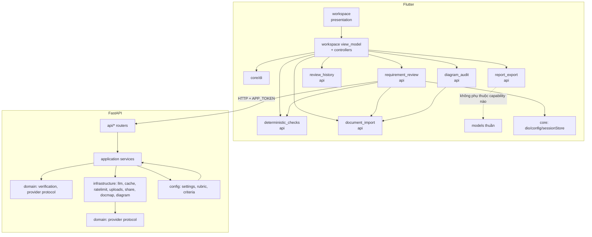

# Kiến trúc đích sau refactor — srs-review-ai

> ADR-0013 kèm tài liệu này ghi quyết định; file này là bản đồ thực thi: kiến trúc
> hiện tại, cây package đích, diagram component, luật phụ thuộc và kế hoạch
> migration từng bước. Refactor bảo toàn 100% hành vi công khai (UI flow, API
> path/JSON, parser semantics, cache key, rate limit, mock mode, pacing).

## 0. As-built — đã thực hiện xong (2026-09-26)

Kế hoạch ở các mục 1–10 dưới đây là bản viết trước khi sửa; mục này là kết quả
thực tế, để hai bản không lệch nhau im lặng.

| Hạng mục | Trước | Sau |
|---|---|---|
| `app/lib/data/` | 50 file, 5 capability trộn | **không còn** — 6 component headless |
| `workspace_view_model.dart` | 2.063 dòng, 1 class | 692 dòng: state + copyWith + façade |
| Controller use case | — | 7 file, 71–418 dòng (+ base 71 dòng) |
| `server/app/main.py` | 1.164 dòng | ~120 dòng: bootstrap + router + composition root |
| Tầng server | 1 package phẳng | `api/ application/ domain/ infrastructure/ config/ contracts/` |
| Guardrails luật layering | bám `data/` (no-op sau khi move) | bám component + route seam đã cập nhật |

**Commit:** `215da54` (app: 6 component) → `86a695d` (notifier thành façade trên
7 controller); server `6dd304d` (contracts/domain/infrastructure/config) +
`e21e961` (api/ + application/).

**Kiểm chứng:** `flutter analyze --fatal-infos` sạch, `dart format` sạch, **902
test app pass** (không test nào phải sửa), server **212 passed / 1 skipped**,
`ruff check` + `ruff format --check` sạch, `tools/check_guardrails.py` pass cả 7
nhóm, `server/tests/test_layering.py` (AST + pin 20 endpoint) pass.

**Khác với kế hoạch ban đầu, và vì sao:**

1. **7 controller, không phải 6.** `ReviewRunController` vẫn 590 dòng vì nửa của
   nó là vision pass; grep xác nhận hai nửa không gọi nhau, nên tách
   `DiagramAuditController` (còn 418 dòng) là ranh giới sạch, không phải chia nhỏ
   hình thức.
2. **Controller là `part` của cùng library với notifier, không phải library
   riêng.** Riverpod đánh dấu `Notifier.ref`/`Notifier.state` là `@protected`, và
   controller cần cả nội bộ session (`_document`, `_pdfBytes`, `_log`,
   `_scheduleToastClear`). Notifier mở đúng hai cửa `workspaceRef` /
   `workspaceState`; mọi thứ còn lại giữ nguyên đóng gói, thay vì public hoá nội
   bộ để có vẻ "sạch".
3. **Ba decoder payload thành hàm top-level** trong library
   (`_decodeProjectInfo`, `_decodeHumanIssues`, `_decodeReportLanguage`): Dart
   không cho static member và instance member trùng tên, mà chúng là hàm thuần
   trên một persisted payload — không thuộc về class nào.
4. **Shim tương thích giữ lại** ở đường dẫn server cũ (`app.schemas`, `app.cache`,
   `app.llm.*`, …). Chúng chỉ re-export; test cũ chạy nguyên, và xoá được ở một
   major sau.

**Còn nợ (mục 10 ghi tiếp):** shim đường dẫn cũ; `_document`/`_pdfBytes`/`_store`
vẫn nằm trên notifier (đúng theo thiết kế — chúng là session, không phải use
case); `docs/arch-*-notes.md` là bản khảo sát trước refactor, đã được viết lại
đường dẫn nhưng số đo vẫn là của lần khảo sát 2026-09-25.

## 1. Kiến trúc hiện tại (đo được từ import graph, 2026-09-25)

### Flutter `app/lib` (~32.5k dòng)

```
core/                          app_config, providers (423 dòng gom TOÀN BỘ DI), router, theme, widgets
data/                          ← GOD LAYER: 50 file phẳng, 5 capability trộn nhau
  checks/                      12 engine + verifier + criteria_catalog + diagram_detector...
  models/                      13 model dùng chéo
  parsing/                     requirement_splitter (916), blueprint_builder, table_of_contents
  repositories/                document_repository, review_repository (789)
  services/                    19 file: api_service, parse_service, session_store(+database),
                               vision_review_service, page_image_*, upload_service, report_exporter, mock_review_api...
features/workspace/            duy nhất một feature, chứa CẢ models nghiệp vụ
  models/                      report builders (873+756+658), workspace_unit/findings (dùng chéo)
  view/                        18 file, lớn nhất workspace_modals 2472
  view_model/                  WorkspaceViewModel 2064 dòng — god class, 6 use case
```

Import graph đo được:

```
core -> data/checks, data/models, data/repositories, data/services, features/workspace
data/checks -> data/models          data/models -> data/checks
data/parsing -> data/checks, data/models
data/repositories -> core, data/checks, data/models, data/services
data/services -> core, data/checks, data/models, data/parsing
features/workspace -> core, data/checks, data/models, data/services
```

Hai vòng dépendance trong data: `checks ↔ models` (verifier.dart cần DeterministicFinding,
deterministic_finding.dart cần CheckId), và `core → features/workspace` (providers.dart
import workspace_view_model). `data/repositories → data/checks` là phụ thuộc thật
(review repository chạy deterministic checks sau khi AI trả về).

### FastAPI `server/app` (~5.2k dòng)

```
main.py        1164 dòng GOD MODULE: 20 route + auth + middleware + bootstrap + orchestration
schemas.py     306 — pydantic request/response (đã là contracts layer trên thực tế)
verify.py 148, prompt.py 245, criteria.py 395 + criteria.json, rubric.py/rubric_store.py 308 + rubric.json
cache.py 58, store.py 299 (SQLite), ratelimit.py 40, uploads.py 314, share.py 58, docmap.py 453, diagram.py 321
llm/           base, router, gemini (355), mock (257), pacing (170)
```

God module `main.py` làm cả 4 việc: bootstrap app, auth/middleware, route handler,
và orchestration use case (cache lookup + pacing + verify + rubric/chimney cho
`/review` và `/review/batch`).

### Guardrails hiện tại

`tools/check_guardrails.py` (LAYER_RULES) soi theo path fragment:
`app/lib/features/` + `/view/` không được import `data/services/|dio|data/repositories/`;
`/view_model/` không được import material//view/; `app/lib/data/` không được import
`features/` hay material; `data/models/` không import dio/services. **Mọi move file
phải đồng bộ LAYER_RULES, nếu không luật tê liệt im lặng.**

## 2. Cây package đích

### Flutter — business capability component

Mỗi component là một thư mục con của `lib/`, có thư mục `api.dart` (export công khai
duy nhất) nếu được phép bị phụ thuộc. Component KHÔNG có `api.dart` = private cho repo
(ví dụ `document_import` chỉ bộc lộ qua `requirement_review`? Không — xem §3: nó bộc
lộ qua workspace shell).

```
app/lib/
  core/                        # shared: config, router, theme, widgets, di base
    app_config.dart
    router/
    theme/
    widgets/
    di.dart                    # providers "plumbing" (sessionStore, prefs, dio, env) — không gom use case
  document_import/
    api.dart                   # exports: LoadedDocument, SrsDocument, DocumentRepository, ParseService,
                               #          WorkspaceUnit, UnitKind, file picker seam
    models/                    # loaded_document, srs_document, workspace_unit (dùng chéo), project_info
    parsing/                   # requirement_splitter, blueprint_builder, table_of_contents
    repositories/              # document_repository, parse_service
    services/                  # file_picker_service, upload_service, document_map_service
  requirement_review/
    api.dart                   # exports: ReviewRepository, ReviewProgress, ReviewIssue/Result, IssueType,
                               #          ReportLanguage (model chuyển tầng), mock_review_api
    models/                    # review_models, review_progress, report_language, finding_status, human_issue
    repositories/              # review_repository
    services/                  # api_service, review_api, mock_review_api
  deterministic_checks/
    api.dart                   # exports: các engine checks, Verifier, CheckId, DeterministicFinding,
                               #          CriteriaCatalog, DiagramTypeClassifier
    checks/                    # 12 engine + text_fold + rubric_config
    verifier.dart
    criteria_catalog.dart
  diagram_audit/
    api.dart                   # exports: VisionReviewService, DiagramAuditor, PageImageRenderer/Selector,
                               #          ImageBudget, DiagramAudit, DocumentMap
    models/                    # diagram_audit, document_map
    services/                  # vision_review_service, page_image_renderer, page_image_selector, image_budget
  review_history/
    api.dart                   # exports: SessionStore, SavedSession, openSessionStore
    services/                  # session_store, session_database(+platform_*)
  report_export/
    api.dart                   # exports: buildMarkdown/Html/Json/DocxReport, ReportStrings, ReportExporter
    report_export.dart, html_report.dart, docx_report.dart, report_strings.dart, report_exporter.dart
  workspace/                   # presentation duy nhất được giữ ở features/
    view/                      # giữ nguyên 18 file
    view_model/                # WorkspaceViewModel (facade mỏng) + controllers mới (§5)
  features/workspace/models/   # TAN BIEN — chia về document_import/review/report (§4 mapping)
```

Quyết định liên quan mục tiêu gốc của user: "data/core/features chưa thể hiện rõ
business component" — thay vì giữ tầng `data/` vô nghĩa, các model/service/repository
đi theo capability của nó. `features/` chỉ còn presentation (workspace). Đây là
thay đổi path thật (không phải đổi tên), chi phối guardrails.

### FastAPI — layered theo bounded context

```
server/app/
  main.py            # chỉ còn: create_app, CORS, auth dependency wiring, include_router, uvicorn entry
  api/               # route handlers THUẦN: nhận request -> gọi application service -> trả response
    deps.py          # require_app_token, get_settings, get_cache, get_rate_limiter... (FastAPI Depends)
    health.py        # /health
    rubric.py        # /rubric CRUD + /rubric/reset
    criteria.py      # /criteria CRUD + /criteria/reset
    review.py        # /review, /review/batch
    ask.py           # /ask
    diagram.py       # /diagram, /documents/render
    uploads.py       # /uploads/presign, /uploads/{key}, /uploads/{key}/meta
    share.py         # /share, /share/{share_id}
  application/       # orchestration use case — KHÔNG biết FastAPI/HTTP
    review_service.py       # single review: cache -> pacer -> provider -> verify (từ main.py 430–705)
    batch_review_service.py # batch: theo ADR 0010 (group 6, retry pacing)
    ask_service.py, diagram_audit_service.py, document_qa_service.py
    rubric_service.py, criteria_service.py (mỏng, ủy cho infra stores)
  domain/            # business rule thuần, không import fastapi/dio/gemini/fs
    verification.py   # verify_quote, review_issues, resolve_* (từ verify.py)
    provider.py       # Protocol LlmProvider + LlmError (từ llm/base.py)
    errors.py         # domain errors (LlmError, VerificationError...)
  infrastructure/
    llm/              # router.build_provider, gemini, mock, pacing (giữ nguyên module)
    cache.py          # cache_key + SqliteCache (cache.py + store.py gộp quyền hạn: cache_key vào infra)
    ratelimit.py, uploads.py, share.py, docmap.py, diagram.py
  config/
    settings.py       # config.py (Settings, get_settings)
    rubric.py         # rubric.py + rubric_store.py (nạp/ghi rubric là config-persistence)
    criteria.py       # criteria.py + criteria.json
  contracts/
    schemas.py        # pydantic request/response (giữ nguyên mọi tên class)
```

Lưu ý bảo toàn: `prompt.py` là prompt-building cho review — đưa vào `application/`
(prompt_assembly.py) vì nó điều phối văn bản gửi model theo criteria/rubric; nó thuần
nên không vi phạm domain purity. Cache key nằm ở `infrastructure/cache.py` nhưng
LUẬT "mọi giá trị vào prompt phải vào key" được ghi trong docstring + guardrail test.

## 3. Component diagram (đích)



## 4. Luật phụ thuộc (bắt buộc, kiểm chứng bằng guardrails mới)

Flutter (soi import trong `check_guardrails.py`, thay LAYER_RULES cũ):

| Từ | Được phép | Cấm |
|---|---|---|
| `lib/workspace/view/**` | `workspace/view_model/**`, `core/**`, `features/workspace/models/**` (trong giai đoạn chuyển), mọi component `api.dart` | `data/services|repositories`, `dio`, bất kỳ file implementation nào ngoài `api.dart` |
| `lib/workspace/view_model/**` | mọi `*/api.dart`, `core/**` | `material/cupertino`, `**/view/**`, file implementation (không qua `api.dart`), `dio` |
| `lib/<capability>/models/**` | trong component | `features/`, `dio`, mọi `services/repositories` |
| `lib/<capability>/services|repositories/**` | models cùng component, `core/**` | `features/`, `material`, component khác ngoài `api.dart` của nó |
| `lib/core/**` | không phụ thuộc capability | import `requirement_review/`, `document_import/`, `workspace/`... (core phải là lá; providers.dart tách để hết vòng) |

FastAPI (kiểm chứng bằng test import-linter đơn giản trong pytest):
- `api/*` import được `application`, `contracts`, `config`; KHÔNG import trực tiếp
  `infrastructure` hay `domain` (trừ qua deps.py wiring).
- `application/*` import `domain`, `config`, contracts-typed dict; không import
  `fastapi`, không import `infrastructure.llm.gemini` trực tiếp (chỉ qua
  provider protocol được inject).
- `domain/*` không import fastapi, google-generativeai, sqlite3, pathlib FS.

## 5. Tách WorkspaceViewModel (giữ facade, không đổi UI)

Thêm controller class (thuần Dart, không widget) trong `workspace/view_model/`:

| Controller | Method chuyển từ WorkspaceViewModel | State vẫn thuộc WorkspaceState |
|---|---|---|
| `ProjectDraftController` | setProjectInfo, createProject, addHumanIssue, removeHumanIssue, _refreshProjectInfoFindings, _saveDraft, _restoreDraft, _decodeProjectInfo, _decodeHumanIssues, _decodeReportLanguage | projectName, projectInfo, humanIssues, reportLanguage |
| `DocumentImportController` | loadDemo, importDocument, _analyzeDocumentOnServer, classifyUnit, setUnitSelected, setSelectedAll, _mutateUnit | fileName, units, pageTexts, documentFingerprint, parserVersion, uploadUri |
| `ReviewRunController` | runReview, cancelReview, _onRunFinished, _startElapsedTicker, _visionService, auditDiagrams, setFindingStatus, verifyStatuses | progress, result, findings, imageCoverage, runReviewed... |
| `HistoryController` | loadHistory, _loadRecentSessions, openSession, deleteSession, _saveSession | history, recentSessions |
| `ExportController` | exportMarkdown/Html/Json/Docx, shareReport, reportFileName, setReportLanguage | reportLanguage (persist qua draft controller) |
| `AskController` | askDocument, askQuestion | askOutcome |

WorkspaceViewModel giữ nguyên TẤT CẢ method public nhưfacade 1 dòng ủy quyền
→ 902 test hiện tại + 18 view file không phải đổi. Mỗi controller nhận
`(Ref ref, StateController<WorkspaceState> state)` hoặc trỏ thẳng vào notifier
— chi tiết trong code. Kết quả mong đợi: view_model.dart còn ~400 dòng
(state + copyWith + facade), controller 200–400 dòng mỗi cái.

## 6. Mapping file hiện tại → component mới (Flutter)

| Hiện tại | Đích |
|---|---|
| `data/models/loaded_document.dart` | `document_import/models/` |
| `data/models/srs_document.dart` | `document_import/models/` |
| `data/models/project_info.dart` | `document_import/models/` |
| `data/features/workspace/models/workspace_unit.dart` | `document_import/models/workspace_unit.dart` |
| `data/parsing/*` | `document_import/parsing/` |
| `data/repositories/document_repository.dart` | `document_import/repositories/` |
| `data/services/parse_service.dart` | `document_import/repositories/parse_service.dart` |
| `data/services/file_picker_service.dart` | `document_import/services/` |
| `data/services/upload_service.dart` | `document_import/services/` |
| `data/services/document_map_service.dart` | `document_import/services/` |
| `data/models/review_models.dart` | `requirement_review/models/` |
| `data/models/review_progress.dart` | `requirement_review/models/` |
| `data/models/finding_status.dart` | `requirement_review/models/` |
| `data/models/human_issue.dart` | `requirement_review/models/` |
| `data/models/report_language.dart` | `requirement_review/models/` |
| `data/repositories/review_repository.dart` | `requirement_review/repositories/` |
| `data/services/api_service.dart`, `review_api.dart` | `requirement_review/services/` |
| `data/services/mock_review_api.dart` | `requirement_review/services/` |
| `data/checks/syllabus_checks.dart` + 11 engine khác | `deterministic_checks/checks/` |
| `data/checks/verifier.dart` | `deterministic_checks/verifier.dart` |
| `data/checks/criteria_catalog.dart` | `deterministic_checks/` |
| `data/checks/rubric_config.dart`, `text_fold.dart` | `deterministic_checks/checks/` |
| `data/models/deterministic_finding.dart` | `deterministic_checks/models/` |
| `data/checks/diagram_detector.dart`, `diagram_type_classifier.dart` | `deterministic_checks/checks/` (chúng phân loại, không render) |
| `data/models/diagram_audit.dart`, `document_map.dart` | `diagram_audit/models/` |
| `data/services/vision_review_service.dart` | `diagram_audit/services/` |
| `data/services/page_image_renderer.dart`, `page_image_selector.dart`, `image_budget.dart` | `diagram_audit/services/` |
| `data/services/session_store.dart`, `session_database*.dart` | `review_history/services/` |
| `features/workspace/models/report_export.dart`, `html_report.dart`, `docx_report.dart`, `report_strings.dart` | `report_export/` |
| `data/services/report_exporter.dart` | `report_export/report_exporter.dart` |
| `features/workspace/models/workspace_findings.dart`, `document_verdict.dart`, `section_scores.dart`, `ask_document.dart`, `workspace_tab.dart`, `demo_units.dart` | `workspace/models/` (presentation-adjacent) |
| `core/providers.dart` | `core/di.dart` (tách nhỏ: app_providers, store_providers, infra_providers) |

## 7. Mapping server hiện tại → đích

| Hiện tại | Đích |
|---|---|
| `main.py` | `main.py` (bootstrap) + `api/*` (routes) + `application/review_service.py`, `batch_review_service.py`, `ask_service.py`, `diagram_audit_service.py`, `document_qa_service.py` |
| `schemas.py` | `contracts/schemas.py` |
| `verify.py` | `domain/verification.py` |
| `llm/base.py` | `domain/provider.py` |
| `llm/gemini.py`, `llm/mock.py`, `llm/router.py`, `llm/pacing.py` | `infrastructure/llm/*` |
| `cache.py` + `store.py` | `infrastructure/cache.py` (cache_key + SqliteCache) |
| `ratelimit.py` | `infrastructure/ratelimit.py` |
| `uploads.py`, `share.py`, `docmap.py`, `diagram.py` | `infrastructure/*` |
| `config.py` | `config/settings.py` |
| `rubric.py` + `rubric_store.py` | `config/rubric.py` + `config/rubric_store.py` |
| `criteria.py` + `criteria.json` | `config/criteria.py` + json |
| `prompt.py` | `application/prompt_assembly.py` |

## 8. Migration plan (mỗi bước build/test được)

### Flutter (mỗi bước = 1 commit, chạy format/analyze/test sau bước)

1. **F1** Tạo `core/di.dart` (providers plumbing) — providers.dart tách mỏng,
   re-export lại cho tương thích. Không move khác.
2. **F2** Move `data/models/{loaded_document,srs_document,project_info}.dart` +
   `data/parsing/*` + `parse_service` + `document_repository` + `file_picker/upload/document_map_service`
   → `document_import/`; tạo `document_import/api.dart`. Sửa import tại call sites.
3. **F3** Move review models + repositories + api services + mock + report_language
   → `requirement_review/`; `requirement_review/api.dart`.
4. **F4** Move checks + verifier + criteria + diagram classifier → `deterministic_checks/`.
   (Giải vòng checks↔models bằng cách giữ DeterministicFinding trong models của component.)
5. **F5** Move diagram_audit (vision service, renderer, selector, budget, models).
6. **F6** Move session_store/session_database → `review_history/`.
7. **F7** Move report builders + exporter → `report_export/`.
8. **F8** Tách WorkspaceViewModel thành 6 controller + facade; state và method
   public giữ nguyên tên.
9. **F9** Xóa `features/workspace/models` cũ (đã rỗng), cập nhật guardrails
   LAYER_RULES mới theo §4, chạy toàn bộ validation.

### Server (mỗi bước = 1 commit, pytest + ruff sau bước)

1. **S1** Tạo cấu trúc thư mục + `contracts/schemas.py` (re-export schemas cũ);
   `main.py` import lại từ đó. Ruff/pytest xanh.
2. **S2** Move `verify.py` → `domain/verification.py`, `llm/base.py` →
   `domain/provider.py`; `llm/*` còn lại → `infrastructure/llm/`.
3. **S3** Move cache/store/ratelimit/uploads/share/docmap/diagram → `infrastructure/`.
4. **S4** Move config.py → `config/settings.py`; rubric*/criteria* → `config/`;
   prompt.py → `application/prompt_assembly.py`.
5. **S5** Tách route: rubric/criteria/health ra `api/` router đầu tiên (nhẹ nhất),
   rồi review/batch, ask, diagram, uploads, share. Application service tách dần
   từ phần orchestration trong main.py (mỗi route 1 service).
6. **S6** main.py chỉ còn bootstrap + include_router; thêm test import-linter
   (pytest) kiểm tra dependency direction §4.

### Tài liệu

- **D1** `docs/architecture-refactored.md` (file này) + ADR 0013.
- **D2** Cập nhật `tools/check_guardrails.py` LAYER_RULES + docstring đầu file.
- **D3** Cập nhật `docs/adr/README.md`, ghi chú trong `review-rules/README` nếu cần.

## 9. Những gì KHÔNG đổi (ràng buộc bảo toàn, đã kiểm bằng test)

- Mọi endpoint, path, status code, JSON shape (`test_contract.py`, `test_api.py`).
- Parser output/semantics/page index (`srs_pipeline_qa_test`, `requirement_splitter_test`).
- Cache key 11 thành phần + cooldown pacing (`test_pacing.py`, `test_store.py`).
- Rate limit 12 req/min + burst 4, quota 50/ngày.
- Mock mode, batching 6 unit/call, retry/cooldown semantics.
- Session/history/draft behavior (`workspace_session_store_test`,
  `session_database_test`, `workspace_view_model_test`).
- UI flow: mọi widget test không đổi.

## 10. Rủi ro đã nhận diện

- Import tương đối `../../` trên Windows: phải verify bằng `flutter analyze` sau
  MỖI move batch, không để dồn.
- Test file import sâu (`../lib/data/...`) — sẽ được sửa cùng batch move; không
  đổi tên test, không xóa test.
- `features/workspace/models` bị import chéo bởi view — move report builders ra
  feature là thay đổi import lớn nhất; làm ở bước F7 riêng.
- WorkspaceViewModel facade có thể bị test gọi method thông qua notifier — giữ
  nguyên signature, chỉ delegate.
