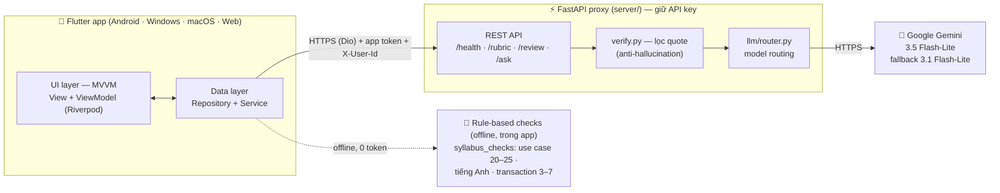
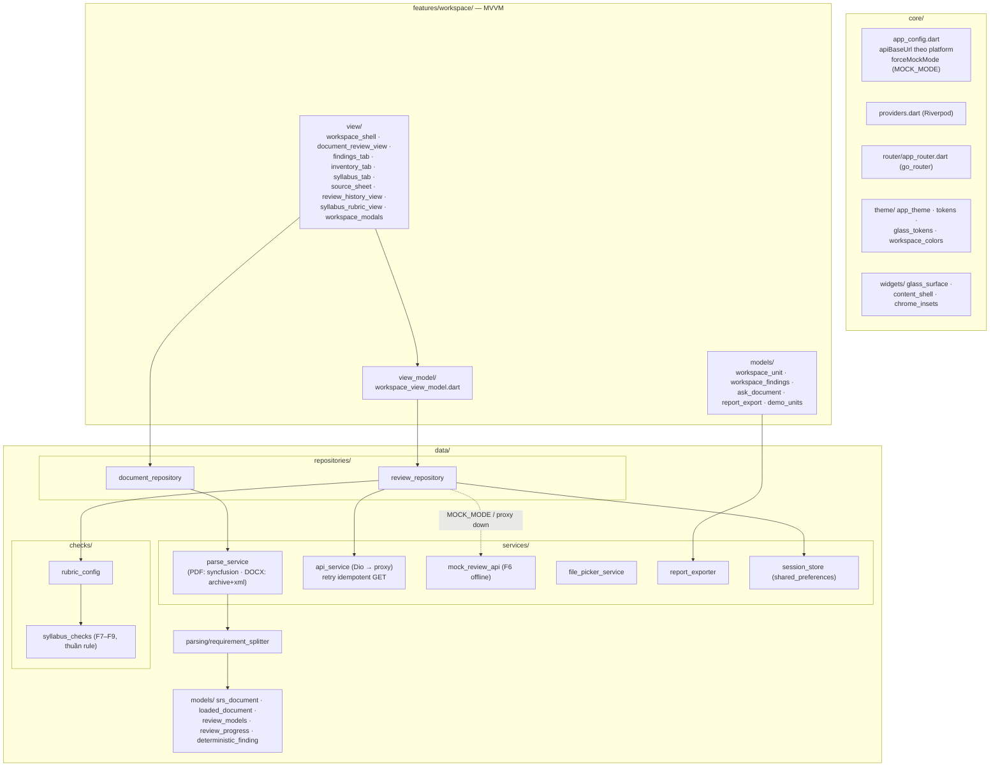
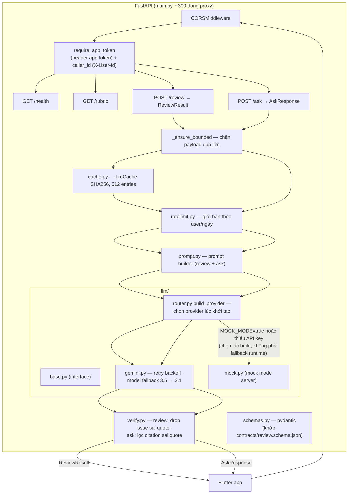
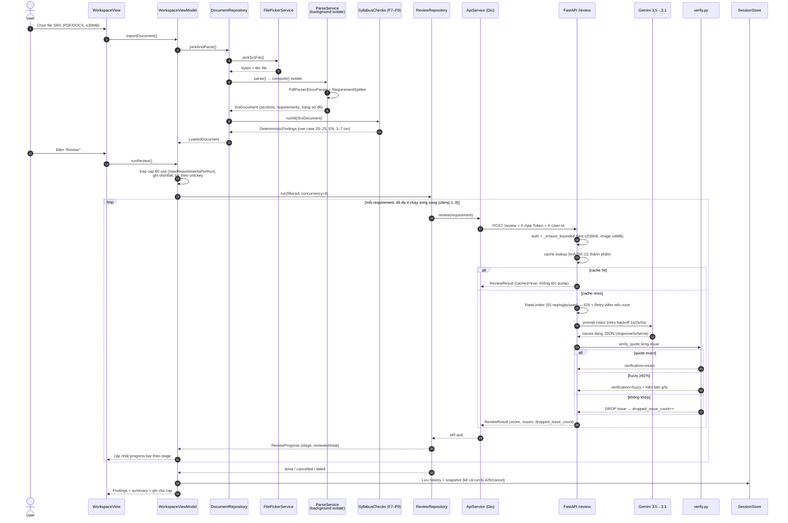
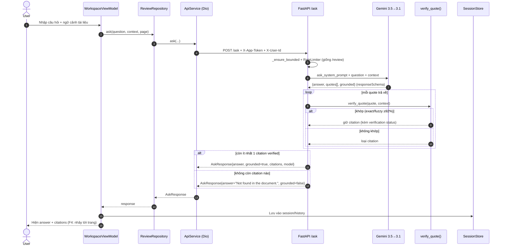
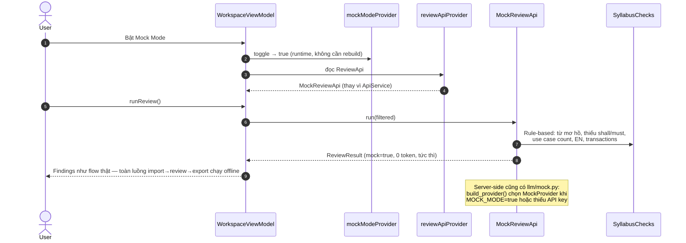

# Kiến trúc SRS Review AI

> Nguồn: `README.md`, `docs/adr/0001-architecture.md`, `docs/adr/0004-model-selection.md`, `pubspec.yaml`, source `app/lib` + `server/app`.
> Kiểu kiến trúc: **MVVM 2 lớp (UI + Data), không tầng domain** (ADR-0001 D3) — client parse tài liệu, server là proxy mỏng giữ API key.

## 1. Bức tranh tổng thể (3 khối)



Điểm nhấn kiến trúc (ADR-0001 D6/D8): app **không** gọi LLM trực tiếp — key nằm trong proxy, và proxy **chỉ trả issue có quote trùng khớp văn bản gốc** (exact, hoặc fuzzy ≥92%; không khớp → bỏ issue, đếm vào `dropped_issue_count`).

## 2. Kiến trúc bên trong app Flutter (`app/lib`)



**State management:** Riverpod 3 (`flutter_riverpod ^3.4.3`, dùng `Notifier`/`NotifierProvider`). Trái tim app là `WorkspaceViewModel extends Notifier<WorkspaceState>` (~981 dòng): units, review progress, history, toasts. Wiring DI nằm hết ở `core/providers.dart`: `reviewApiProvider` chọn `MockReviewApi` hay `ApiService` theo `mockModeProvider` (**toggle runtime**, không cần rebuild), cùng `proxyUrlProvider` (URL proxy người dùng tự cấu hình), `appTokenProvider`, `userIdProvider` (ID ẩn danh theo install).

**Điều hướng:** `go_router` với `StatefulShellRoute.indexedStack` — mỗi branch giữ state scroll/tab riêng, 3 route chính:

| Route | Màn hình |
|---|---|
| `/workspace` (AppRoutes.workspace) | Màn chính: upload → review → findings |
| `/history` | Lịch sử các lần review |
| `/syllabus` | Rubric/điểm chuẩn giáo trình |

**Luồng dữ liệu upload:** `file_picker_service` → `parse_service` (PDF/DOCX **parse ngay trên client**, ADR D5) → `requirement_splitter` tách requirement → `srs_document`/`loaded_document` → từng requirement gửi qua `review_repository`.

## 3. Kiến trúc server FastAPI (`server/app`)



**Dòng chảy một review (F1–F4):**

1. App parse SRS thành sections + requirement items trên device (F1).
2. Mỗi requirement → `POST /review` (kèm app token, `X-User-Id`).
3. Proxy kiểm biên (`_ensure_bounded`), tra cache, áp rate limit theo user.
4. `prompt.py` dựng prompt theo rubric (rubric.py) → `llm/router.py` gọi **gemini-3.5-flash-lite**, lỗi thì fallback **gemini-3.1-flash-lite** (ADR-0004).
5. **verify.py** đối chiếu từng `quote` trong issue với văn bản gốc: exact → badge xanh; fuzzy ≥92% → badge vàng + hiện bản gốc; không khớp → **bỏ issue**, đếm `dropped_issue_count` (D8).
6. App gộp kết quả LLM với findings rule-based (F7–F9) → issue cards (F2), summary score (F3), tap issue → quote trong ngữ cảnh + nhảy trang (F4).
7. F5: hỏi đáp tự do qua `POST /ask` — có cùng biên (bounded, rate limit, provider) như `/review` nhưng **không đi qua lọc issue**; thay vào đó từng citation quote được `verify_quote()` kiểm trước khi trả, và nếu không còn citation verified nào thì `grounded=false` → trả "Not found in the document." F6: toàn luồng chạy `mock_review_api`/`llm/mock.py` không cần mạng.

## 4. Ranh giới & hợp đồng

- **`contracts/review.schema.json`** = hợp đồng dữ liệu chia sẻ giữa app và server; `server/tests/test_contract.py` và fixtures khóa hai phía lại với nhau.
- **Config app** (`app_config.dart`): `--dart-define=API_BASE_URL` ghi đè; mặc định `http://localhost:8000` (web), Android emulator dùng `10.0.2.2`. `--dart-define=MOCK_MODE=true` ép offline.
- **Không có DB bên ngoài** — persistence phía app chỉ `shared_preferences` (session/history); server stateless + cache.

## 5. Sequence diagram

### Cách đọc nhanh

Hãy đọc hệ thống theo 4 lớp sau:

```text
1. App mở        → khôi phục snapshot + lấy trạng thái/rubric của proxy
2. Import file   → đọc PDF/DOCX hoàn toàn trên thiết bị, không upload nguyên file
3. Review        → chọn tối đa 60 unit, gửi từng requirement; tối đa 4 request song song
4. Proxy         → auth → giới hạn payload → cache → (cache miss mới rate-limit) → Gemini → verify quote
```

`60` là tổng số unit trong một lượt; `4` là số request đồng thời. Khi cache hit, request trả ngay và không tiêu quota. Nếu một unit lỗi riêng lẻ (ví dụ 413/422), unit đó vào `failures` và các unit khác vẫn chạy; chỉ `401` hoặc `429` mới dừng toàn bộ run. Với `/ask`, app tìm kiếm local trước; chỉ khi có unit phù hợp mới tạo context giới hạn và gọi proxy. Nếu `/ask` đã gọi proxy nhưng proxy lỗi, ViewModel vẫn fallback về các passage local và ghi rõ là không có model trả lời.

### 5.1 Luồng review đầy đủ (F1–F4) — parse local → review từng requirement → findings



### 5.2 Luồng hỏi đáp tài liệu (F5) — `/ask` với lọc citation



Lưu ý khác biệt với `/review`: `/ask` **không** có cache và **không** drop issue — chỉ lọc citation; mọi claim của answer phải neo vào ít nhất một citation verified, nếu không answer bị thay bằng "Not found in the document."

### 5.3 Luồng offline mock (F6) — không mạng, không tốn token



## 6. Quyết định kiến trúc quan trọng (ADR)

| ADR | Quyết định |
|---|---|
| [0001](adr/0001-architecture.md) | MVVM 2 lớp, không domain layer; parse client-side; proxy mỏng giữ key; anti-hallucination bằng quote verification |
| [0002](adr/0002-no-codegen.md) | Không sinh code tự động |
| [0003](adr/0003-syncfusion-licence.md) | Giấy phép Syncfusion (PDF parsing) |
| [0004](adr/0004-model-selection.md) | Model Gemini 3.5 Flash-Lite + fallback 3.1 |
| [0005](adr/0005-run-cap-vs-quota.md) | Run cap 60 nằm trên quota 50/ngày/người |
| [0006](adr/0006-desktop-edition-three-decisions.md) | Desktop: window sizing native-only, command registry, uplift màn lớn |
| [0007](adr/0007-m3-adaptive-thresholds.md) | M3 window class cho rail; dialog căn giữa miễn trừ trên phone |
| [0008](adr/0008-kiraai-provider-evaluation.md) | Không dùng KiraAI làm provider chính |

Chỉ mục đầy đủ + số ADR tiếp theo: [`adr/README.md`](adr/README.md).
