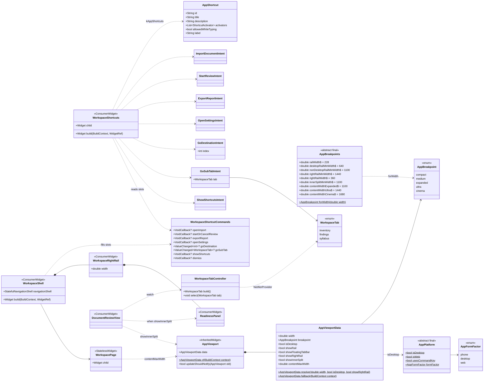
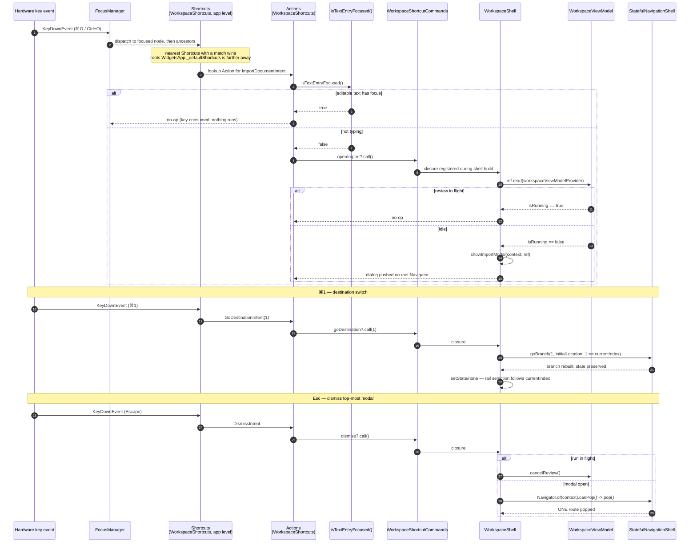
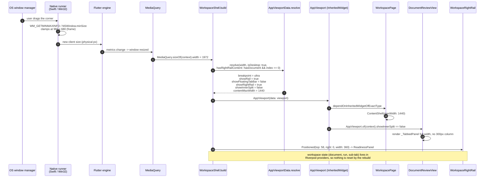
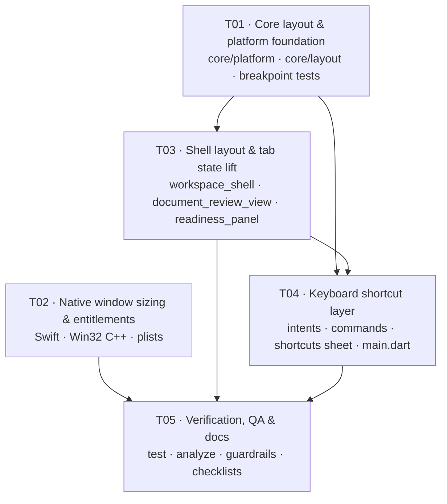

# Architecture — SRS Review AI · Desktop Edition (Windows + macOS)

| Field | Value |
| --- | --- |
| Document | ARCHITECTURE-desktop-2026-09-12 |
| Date | 2026-09-12 |
| Author | Architect (Gao) |
| Status | Draft · for Engineer hand-off |
| Upstream | `docs/desktop/PRD-desktop-2026-09-12.md` |
| Language | English (technical deliverable) |
| Stack | Dart · Flutter 3.44.6 · Dart SDK ^3.12.2 · package `srs_review_ai` |

Companion diagrams:

- `docs/desktop/class-diagram.mermaid`
- `docs/desktop/sequence-diagram.mermaid`

---

## 0. What was read before designing (not assumed)

Every statement below is grounded in a line of code that was read in this
working tree on 2026-09-12.

| Claim | Evidence |
| --- | --- |
| The shell has exactly one breakpoint | `features/workspace/view/workspace_shell.dart:56` — `final isWide = MediaQuery.sizeOf(context).width >= 1100;` |
| `!isWide` ⇒ `Scaffold.drawer` + floating `_GlassTabBar` + hamburger | `workspace_shell.dart:176,186,191,200` |
| `WorkspacePage` hard-codes content `maxWidth: 1100` | `workspace_shell.dart:977` |
| Sub-tab state is private | `document_review_view.dart:31` — `WorkspaceTab _tab` inside `_DocumentReviewViewState` |
| `WorkspaceTab` is used **only** in `document_review_view.dart` | grep across `app/lib` + `app/test` |
| Real search fields exist | `inventory_tab.dart:58` (`_query`), `findings_tab.dart:224` (`_query`) — both `_query` are **private state**, no `FocusNode` is exposed |
| No `Shortcuts`/`Actions` anywhere in `lib/` | grep |
| macOS window has no size at all | `macos/Runner/MainFlutterWindow.swift` (15 lines, only VC + plugins) |
| Windows initial size + title | `windows/runner/main.cpp:28-30` — `Size(1280, 720)`, `L"srs_review_ai"` |
| No min-size support in the Win32 template | `windows/runner/win32_window.h` (no `SetMinSize`, no min fields); `win32_window.cpp` `MessageHandler` handles only `WM_DESTROY/DPICHANGED/SIZE/ACTIVATE/DWMCOLORIZATIONCOLORCHANGED` |
| macOS entitlements lack outbound network | `macos/Runner/DebugProfile.entitlements` — sandbox + `network.server` only, **no `network.client`**, no file entitlement |
| Windows plugin list is stale | `windows/flutter/generated_plugins.cmake` lists only `pdfx` |
| `dart:io` is banned | `core/app_config.dart:8-10` — comment states the app must compile for web |
| Framework already binds `Escape → DismissIntent` | `flutter/packages/flutter/lib/src/widgets/app.dart:1272` (`WidgetsApp._defaultShortcuts`) |
| `DismissAction` is abstract, no default impl | `widgets/actions.dart:1561` — so the app must supply its own |
| Existing tests run at 390×844, 1280×852, 1440×900, 1077×909 | grep `physicalSize` in `app/test` |

---

## Part A — System Design

## 1. Implementation approach

### 1.1 The three hard problems

| # | Problem | Why it is hard here |
| --- | --- | --- |
| 1 | **Window sizing (initial + minimum)** | The app must compile for web, so `dart:io` is off the table and `window_manager` / `bitsdojo_window` are banned by decision. Both native runners are stock Flutter templates: macOS never sets a frame, Win32 has no min-size plumbing at all. |
| 2 | **Keyboard layer that reaches modals** | A `Shortcuts` widget installed inside `WorkspaceShell` cannot see a route pushed by `showDialog`, because a dialog is a *sibling* of the shell inside the root `Navigator`'s `Overlay`, not a descendant. `Esc` closing the top-most modal therefore cannot be solved from inside the shell. |
| 3 | **Large-screen layout without touching mobile/web** | PRD AC-4.6 requires non-desktop to be byte-identical. Every width-based change is a regression risk for `workspace_shell_test.dart`, which asserts exact semantics-node names at 390 and 1440. |

### 1.2 Decisions

**D1 — Window sizing is native-only, ~20 lines per platform.**
Initial **1280 × 860** and minimum **960 × 680**, both interpreted as the
**outer window frame** on both operating systems (this is what
`WM_GETMINMAXINFO.ptMinTrackSize` and `NSWindow.minSize` both measure, so the
two platforms agree by construction).

- macOS: `MainFlutterWindow.awakeFromNib()` → `setFrame` + `minSize` + `center()`.
- Windows: `main.cpp` `Size(1280, 860)` + a new `Win32Window::SetMinSize` backed
  by a `WM_GETMINMAXINFO` case in `MessageHandler`.

Rationale: zero Dart dependency, zero plugin, zero `dart:io`, and the OS
enforces the minimum in the compositor rather than in a Dart rebuild. The
template already scales by DPI in `Create()` (`win32_window.cpp:134-140`), so
the new handler reuses the same `FlutterDesktopGetDpiForMonitor` +
`Scale()` helpers that are already in that translation unit — no new API to
guess at.

**D2 — One `Shortcuts` + `Actions` layer installed at app level, fed by a
command registry.**

`MaterialApp.router(builder:)` is applied above the `Navigator`, so a
shortcut layer installed there is an ancestor of *every* route, dialog route
included. The layer itself is dumb: it maps `ShortcutActivator → Intent` and
dispatches each `Intent` to a `VoidCallback`-shaped slot on
`WorkspaceShortcutCommands`, a Riverpod singleton. `WorkspaceShell` fills those
slots on every build, because it is the only widget that owns both
`StatefulNavigationShell` and a `BuildContext` valid for `show*Modal`.

Rationale: keeps `goBranch` semantics identical to a rail tap (no
`context.go()` state-preservation gamble), keeps the shortcut layer free of
navigation state, and keeps `main.dart` to three lines.

**D3 — Escape reuses the framework's `DismissIntent`.**
`WidgetsApp._defaultShortcuts` already binds `Escape → DismissIntent`; there is
no concrete `DismissAction` in the framework, so the app supplies one. Our
layer also binds Escape explicitly (to the same intent) so behaviour does not
depend on framework defaults. Because our `Shortcuts` is *nearer to the focus*
than the root one, exactly one action runs — no double-pop.

**D4 — Platform detection without `dart:io`.**
`core/platform/app_platform.dart` uses `kIsWeb` + `defaultTargetPlatform` from
`package:flutter/foundation.dart`. `TargetPlatform.linux` is deliberately
**not** treated as desktop (Linux is out of scope, and an existing test already
overrides to `linux` at 1280×852 — see §9 R1).

**D5 — All large-screen uplift is gated on `isDesktop`.**
Content `maxWidth` and the shell-level right rail change **only** when
`isDesktop` is true. Below 1440 dp nothing changes at all. On web and mobile
every number in `AppViewportData` resolves to today's value, which makes
AC-4.6 true *by construction* rather than by test luck.

**D6 — Sub-tab state is lifted to a Riverpod notifier.**
`WorkspaceTab` moves to `features/workspace/models/workspace_tab.dart` (a plain
enum, no Flutter import) so that the `view_model` controller can reference it
without importing `/view/` — which `tools/check_guardrails.py` bans
(`viewmodel-no-widgets`). The notifier lives in
`features/workspace/view_model/workspace_tab_controller.dart`.

**D7 — `Ctrl/Cmd+F` (find) is P1, not P0.**
The search fields are real (`inventory_tab.dart:58`, `findings_tab.dart:224`)
but both `_query` fields are private `State` with no `FocusNode` exposed. Making
`Ctrl/Cmd+F` focus them requires a new focus-request bus plus edits to two tabs
that already have widget tests — i.e. a new mechanism, not a binding. Per the
team-lead rule ("only bind if no new feature is required"), it is deferred to
P1 with the design sketched in §10.

**D8 — No new Dart dependency. No P0 change to `pubspec.yaml`.**

### 1.3 Architecture pattern

Unchanged: **MVVM + Riverpod 3 + go_router 17**. Desktop adds three small
cross-cutting pieces, all in `core/` or `features/workspace/`:

```
main.dart
  └── ProviderScope
        └── MaterialApp.router
              └── builder → WorkspaceShortcuts          (new: Shortcuts + Actions)
                    └── Navigator (root)
                          ├── DialogRoute  ← Esc / ⌘Enter reach here too
                          └── Router → WorkspaceShell
                                └── AppViewport (InheritedWidget, new)
                                      ├── _Sidebar (rail)          [showRail]
                                      ├── _WorkspaceRightRail      [showRightRail]
                                      └── navigationShell → WorkspacePage → …
```

---

## 2. Breakpoint system (final — this supersedes PRD §P0-d)

### 2.1 Tier table

`AppBreakpoint.forWidth(MediaQuery.sizeOf(context).width)`, logical dp of the
**whole window** (not the content column):

| Tier | Window width (dp) |
| --- | --- |
| `compact` | `< 700` |
| `medium` | `700 – 1099` |
| `expanded` | `1100 – 1439` |
| `ultra` | `1440 – 1999` |
| `cinema` | `≥ 2000` |

### 2.2 Resolved behaviour (`AppViewportData.resolve`)

```dart
showRail            = isDesktop ? width >= 640 : width >= 1100;
showFloatingTabBar  = !showRail;                       // and drawer == !showRail
showRightRail       = isDesktop && width >= 1440 && destinationIndex == 0 && hasDocument;
showInnerSplit      = !showRightRail && width >= 1100; // in-content 300px readiness column
contentMaxWidth     = !isDesktop
                        ? 1100
                        : (width >= 2000 ? 1680 : (width >= 1440 ? 1440 : 1100));
```

| Tier | Rail (228px) | Floating tab bar + drawer | Content `maxWidth` | Shell right rail (360px) | In-content right column (300px) | Metric cards |
| --- | --- | --- | --- | --- | --- | --- |
| `compact` (<700) | desktop: yes (width ≥ 640); non-desktop: **no** | non-desktop only | 1100 | no | no (stacked) | `contentWidth >= 700 ? 4 : 2` (unchanged) |
| `medium` (700–1099) | desktop: yes; non-desktop: **no** | non-desktop only | 1100 | no | no (stacked) | unchanged |
| `expanded` (1100–1439) | yes | no | 1100 | no | **yes** — today's behaviour | unchanged |
| `ultra` (1440–1999) | yes | no | **1440** (desktop only) | **desktop only** | desktop: no; non-desktop: yes | unchanged |
| `cinema` (≥2000) | yes | no | **1680** (desktop only) | **desktop only** | desktop: no; non-desktop: yes | unchanged |

### 2.3 Consequences — read this before implementing

1. **On desktop the rail is always shown.** The minimum window is 960 × 680
   *frame*, i.e. ≈ **960 × 652 client on macOS** (28pt title bar) and
   ≈ **944 × 641 client on Windows** (31px title bar + 16px borders). The
   narrowest possible desktop client width (≈ 944) is far above the 640 floor,
   so `showRail` is effectively **always true on desktop**. The hamburger, the
   `Scaffold.drawer` and `_GlassTabBar` therefore **never render on desktop**,
   and `chromeInsets.bottom` becomes `0` — the content gains ~72px of height.
   The 640 floor exists only so that a hand-forced tiny test viewport still
   degrades gracefully.
2. **The rail keeps a single 228px width — it does not collapse to 72px
   icon-only.** This is a deliberate deviation from PRD AC-4.5 ("icon-only").
   Rationale: (a) at the 944px minimum client width a 228px rail still leaves
   ~716px of content, which is comfortable; (b) an icon-only variant is a new
   widget variant that would change `_NavItem` layout and therefore endanger
   the two semantics tests that assert exact node names; (c) PRD's own `ultra`
   wireframe draws the 228px rail. The 72px collapse is recorded as **P1**.
3. **The 840dp `compact` content measure is not enabled.** `WorkspacePage`
   currently passes `maxWidth: 1100` at *every* width; capping to 840 would
   change rendering in the 840–1100 band, where `import_run_review_modal_test`
   (1077×909) and the web/tablet path live. Keeping 1100 below 1440 guarantees
   zero diff. Recorded as **P1**.
4. **`contentMaxWidth` and `showRightRail` are desktop-only.** Web at 2560px
   keeps today's 1100 column. That is the price of AC-4.6 and it is a
   deliberate trade: the desktop release must not regress web.
5. **The right rail is only rendered on destination 0 (Document review).**
   The other two destinations have no readiness content; showing an empty 360px
   rail there would be worse than a gutter. `showRightRail` therefore also
   depends on `navigationShell.currentIndex == 0` and on
   `WorkspaceState.hasDocument`.
6. **Adding the right rail at 1440 makes the inventory table *wider*, not
   narrower.** Today at a 1440 window: content 1100, tabbed panel
   `1100 − 300 − 16 = 784`. With the rail: content `1440 − 228 − 360 = 852` and
   the panel takes the whole 852. ✓
7. **AC-4.2 gutter check.** At 2560: `228 + 1680 + 360 = 2268` → **88.6 %**
   (limit 78 %). At 2000: `228 + 1412 + 360 = 2000` → **100 %**. ✓
8. **AC-4.3 (4-up metric cards at ≥1440) needs no code change.** It is already
   driven by the *content* width (`document_review_view.dart:174`,
   `constraints.maxWidth >= 700 ? 4 : 2`), which is ≥ 852 in every ultra/cinema
   case. Only a test is required to pin it.

---

## 3. File list

Paths are relative to the repo root `srs-review-ai/`.

### 3.1 New — Dart (`app/lib/`)

| File | Purpose |
| --- | --- |
| `app/lib/core/platform/app_platform.dart` | `AppPlatform.isDesktop`, `.isWeb`, `.usesCommandKey`, `.formFactor`. `foundation.dart` only — no `dart:io`. |
| `app/lib/core/layout/app_breakpoint.dart` | `AppBreakpoint` enum, all breakpoint/size constants, `AppBreakpoints.forWidth`. |
| `app/lib/core/layout/app_viewport.dart` | `AppViewportData` (resolved layout decisions) + `AppViewport` `InheritedWidget` with a MediaQuery-based fallback. |
| `app/lib/features/workspace/models/workspace_tab.dart` | `enum WorkspaceTab` **moved** out of `document_review_view.dart`. |
| `app/lib/features/workspace/view_model/workspace_tab_controller.dart` | `WorkspaceTabController extends Notifier<WorkspaceTab>` + `workspaceTabProvider`. No material import. |
| `app/lib/features/workspace/view_model/workspace_shortcut_commands.dart` | `WorkspaceShortcutCommands` (8 nullable command slots) + `workspaceShortcutCommandsProvider`. `foundation.dart` + `riverpod` only. |
| `app/lib/features/workspace/view/workspace_shortcuts.dart` | Intent classes, `AppShortcut` descriptors + `kAppShortcuts`, `buildWorkspaceShortcuts()`, `isTextEntryFocused()`, `WorkspaceShortcuts` widget. |
| `app/lib/features/workspace/view/shortcuts_modal.dart` | `showShortcutsModal(context, ref)` — the F1/`?` sheet listing every binding with platform glyphs. Reuses `_show` conventions. |
| `app/lib/features/workspace/view/readiness_panel.dart` | `ReadinessPanel` **moved** out of `document_review_view.dart` (was `_ReadinessPanel`), now public and reads `workspaceTabProvider` itself. |

### 3.2 New — tests

| File | Purpose |
| --- | --- |
| `app/test/support/desktop_test_platform.dart` | `withDesktopPlatform(TargetPlatform, WidgetTester, body)` helper that sets `debugDefaultTargetPlatformOverride` and resets it inline. |
| `app/test/desktop/app_breakpoint_test.dart` | Pure unit tests for `AppBreakpoint.forWidth` and `AppViewportData.resolve` (no widgets). |
| `app/test/desktop/desktop_layout_test.dart` | Overflow-free pump at 640×480, 800×600, 960×680, 1280×860, 1440×900, 1920×1080, 2560×1440, 3840×2160 under `macOS`; rail present / tab bar absent; right rail + `maxWidth` at ultra & cinema; 4-up metrics. |
| `app/test/desktop/workspace_shortcuts_test.dart` | Every P0 binding under `macOS` (⌘) and `windows` (Ctrl); typing guard; Esc-one-modal-per-press; destination & sub-tab switching. |

### 3.3 Modified — Dart

| File | Change |
| --- | --- |
| `app/lib/main.dart` | Add `builder: (context, child) => WorkspaceShortcuts(child: child ?? const SizedBox.shrink())` to `MaterialApp.router`. Nothing else. `themeMode: ThemeMode.system` stays. |
| `app/lib/features/workspace/view/workspace_shell.dart` | Replace `isWide` (line 56) with `AppViewportData`; wrap body in `AppViewport`; pass `showMenuButton: !viewport.showRail`; gate `_GlassTabBar` and `drawer` on `!showRail`; inset content by the right-rail width; add `_WorkspaceRightRail`; register all 8 shortcut commands; add desktop-only rail tooltips and a desktop-only "Keyboard shortcuts" top-bar button; `WorkspacePage` resolves `maxWidth` from the viewport. |
| `app/lib/features/workspace/view/document_review_view.dart` | Delete the local `WorkspaceTab` enum (re-export for compatibility is **not** needed — nothing else imports it); `_tab` → `ref.watch(workspaceTabProvider)`; `ConsumerStatefulWidget` → `ConsumerWidget`; inner `Flex` uses `viewport.showInnerSplit`; delete `_ReadinessPanel` (moved) and import `ReadinessPanel`. |
| `app/lib/features/workspace/view/workspace_modals.dart` | `showHelpModal` gains a "Keyboard shortcuts" row → `showShortcutsModal`. No change to any existing string. |
| `app/lib/features/workspace/view/inventory_tab.dart` | **P0: no change.** (P1 only, for `Ctrl/Cmd+F`.) |
| `app/lib/features/workspace/view/findings_tab.dart` | **P0: no change.** (P1 only, for `Ctrl/Cmd+F`.) |
| `app/lib/core/widgets/content_shell.dart` | **No change** — `WorkspacePage` keeps passing `maxWidth`. |

### 3.4 Modified — native

| File | Change |
| --- | --- |
| `app/macos/Runner/MainFlutterWindow.swift` | `setFrame(1280×860)`, `minSize = 960×680`, `center()`, `title = "SRS Review AI"`. |
| `app/macos/Runner/DebugProfile.entitlements` | **Add** `com.apple.security.network.client` and `com.apple.security.files.user-selected.read-only`. |
| `app/macos/Runner/Release.entitlements` | Same two keys. |
| `app/windows/runner/main.cpp` | `Size(1280, 860)`; title `L"SRS Review AI"`. |
| `app/windows/runner/win32_window.h` | Declare `void SetMinSize(const Size& size);` and add `Size min_size_ = Size(0, 0);` to the private section. |
| `app/windows/runner/win32_window.cpp` | Implement `SetMinSize`; add `case WM_GETMINMAXINFO:` to `MessageHandler`. |
| `app/windows/runner/flutter_window.cpp` | Call `SetMinSize(Size(960, 680));` at the top of `FlutterWindow::OnCreate()` (after the `Win32Window::OnCreate()` guard). |
| `app/windows/flutter/generated_plugins.cmake` | **Do not hand-edit.** Regenerate on Windows (see §9 R4). |

### 3.5 Not created

- No `app/linux/` (out of scope).
- No `main_desktop.dart`, no new package, no `pubspec.yaml` change.

---

## 4. Data structures and interfaces



### 4.1 Signatures

```dart
// core/platform/app_platform.dart
import 'package:flutter/foundation.dart';

enum AppFormFactor { phone, desktop, web }

abstract final class AppPlatform {
  /// True only for the two platforms this workstream targets.
  /// `TargetPlatform.linux` is deliberately excluded: Linux is out of scope and
  /// an existing test overrides to `linux` at 1280x852.
  static bool get isDesktop =>
      !kIsWeb &&
      (defaultTargetPlatform == TargetPlatform.macOS ||
          defaultTargetPlatform == TargetPlatform.windows);

  static bool get isWeb => kIsWeb;

  static AppFormFactor get formFactor => kIsWeb
      ? AppFormFactor.web
      : (isDesktop ? AppFormFactor.desktop : AppFormFactor.phone);

  /// macOS binds ⌘; Windows binds Ctrl. Never both.
  static bool get usesCommandKey =>
      !kIsWeb && defaultTargetPlatform == TargetPlatform.macOS;
}
```

```dart
// core/layout/app_breakpoint.dart
enum AppBreakpoint { compact, medium, expanded, ultra, cinema }

abstract final class AppBreakpoints {
  static const double railWidth = 228;
  static const double desktopRailMinWidth = 640;
  static const double nonDesktopRailMinWidth = 1100;
  static const double rightRailMinWidth = 1440;
  static const double rightRailWidth = 360;
  static const double innerSplitMinWidth = 1100;
  static const double contentWidthExpanded = 1100;
  static const double contentWidthUltra = 1440;
  static const double contentWidthCinema = 1680;

  static AppBreakpoint forWidth(double width) => switch (width) {
    < 700 => AppBreakpoint.compact,
    < 1100 => AppBreakpoint.medium,
    < 1440 => AppBreakpoint.expanded,
    < 2000 => AppBreakpoint.ultra,
    _ => AppBreakpoint.cinema,
  };
}
```

```dart
// core/layout/app_viewport.dart
@immutable
class AppViewportData {
  const AppViewportData({
    required this.width,
    required this.breakpoint,
    required this.isDesktop,
    required this.showRail,
    required this.showFloatingTabBar,
    required this.showRightRail,
    required this.showInnerSplit,
    required this.contentMaxWidth,
  });

  final double width;
  final AppBreakpoint breakpoint;
  final bool isDesktop;
  final bool showRail;
  final bool showFloatingTabBar;
  final bool showRightRail;
  final bool showInnerSplit;
  final double contentMaxWidth;

  factory AppViewportData.resolve({
    required double width,
    required bool isDesktop,
    bool hasRightRailContent = false,
  });

  /// Used when no [AppViewport] is installed above the caller (standalone
  /// widget tests, previews). Mirrors today's behaviour for non-desktop.
  static AppViewportData fallback(BuildContext context);

  @override bool operator ==(Object other);
  @override int get hashCode;
}

class AppViewport extends InheritedWidget {
  const AppViewport({required this.data, required super.child, super.key});
  final AppViewportData data;

  static AppViewportData of(BuildContext context) =>
      context.dependOnInheritedWidgetOfExactType<AppViewport>()?.data ??
      AppViewportData.fallback(context);

  @override
  bool updateShouldNotify(AppViewport oldWidget) => oldWidget.data != data;
}
```

```dart
// features/workspace/view_model/workspace_tab_controller.dart
class WorkspaceTabController extends Notifier<WorkspaceTab> {
  @override
  WorkspaceTab build() => WorkspaceTab.inventory;
  void select(WorkspaceTab tab) => state = tab;
}

final workspaceTabProvider =
    NotifierProvider<WorkspaceTabController, WorkspaceTab>(
  WorkspaceTabController.new,
);
```

```dart
// features/workspace/view_model/workspace_shortcut_commands.dart
import 'package:flutter/foundation.dart';
import 'package:flutter_riverpod/flutter_riverpod.dart';
import '../models/workspace_tab.dart';

/// Command slots. Filled by [WorkspaceShell] on every build (it owns the
/// navigation shell and a context valid for `show*Modal`); invoked by the
/// app-level shortcut layer. A `null` slot means "shortcut is inert" — which
/// is what every widget test that never builds the shell gets.
class WorkspaceShortcutCommands {
  VoidCallback? openImport;
  VoidCallback? startOrCancelReview;
  VoidCallback? exportReport;
  VoidCallback? openSettings;
  ValueChanged<int>? goDestination;
  ValueChanged<WorkspaceTab>? goSubTab;
  VoidCallback? showShortcuts;
  VoidCallback? dismiss;
}

final workspaceShortcutCommandsProvider =
    Provider<WorkspaceShortcutCommands>((ref) => WorkspaceShortcutCommands());
```

```dart
// features/workspace/view/workspace_shortcuts.dart
class ImportDocumentIntent extends Intent { const ImportDocumentIntent(); }
class StartReviewIntent extends Intent { const StartReviewIntent(); }
class ExportReportIntent extends Intent { const ExportReportIntent(); }
class OpenSettingsIntent extends Intent { const OpenSettingsIntent(); }
class GoDestinationIntent extends Intent {
  const GoDestinationIntent(this.index);
  final int index;                      // 0 review · 1 history · 2 syllabus
}
class GoSubTabIntent extends Intent {
  const GoSubTabIntent(this.tab);
  final WorkspaceTab tab;
}
class ShowShortcutsIntent extends Intent { const ShowShortcutsIntent(); }
// DismissIntent (package:flutter/widgets.dart) is reused for Esc.

class AppShortcut {
  const AppShortcut({
    required this.id,
    required this.title,
    required this.description,
    required this.activators,
    this.allowedWhileTyping = false,
  });
  final String id;
  final String title;
  final String description;
  final List<ShortcutActivator> activators;
  final bool allowedWhileTyping;

  /// Human label, platform-correct: `⌘⇧O` on macOS, `Ctrl+Shift+O` elsewhere.
  String get label;
}

/// One source of truth for bindings, labels and the help sheet.
List<AppShortcut> get kAppShortcuts;

Map<ShortcutActivator, Intent> buildWorkspaceShortcuts();

/// True while an [EditableText] owns the primary focus.
bool isTextEntryFocused();

class WorkspaceShortcuts extends ConsumerWidget {
  const WorkspaceShortcuts({required this.child, super.key});
  final Widget child;
  // Shortcuts(shortcuts: buildWorkspaceShortcuts(),
  //   child: Actions(actions: _actions(ref), child: child))
}
```

### 4.2 P0 binding table (authoritative)

| # | Intent | Windows | macOS | Bound in `kAppShortcuts` as | Fires while typing? |
| --- | --- | --- | --- | --- | --- |
| 1 | `ImportDocumentIntent` | `Ctrl+O` | `⌘O` | `SingleActivator(keyO, control/meta: true)` | no |
| 2 | `StartReviewIntent` | `Ctrl+Enter` | `⌘Enter` | `SingleActivator(enter, control/meta: true)` | **yes** |
| 3 | `ExportReportIntent` | `Ctrl+E` | `⌘E` | `SingleActivator(keyE, control/meta: true)` | no |
| 4 | `OpenSettingsIntent` | `Ctrl+,` | `⌘,` | `SingleActivator(comma, control/meta: true)` | no |
| 5 | `GoDestinationIntent(0..2)` | `Ctrl+1/2/3` | `⌘1/2/3` | `SingleActivator(digit1..3, control/meta: true)` | no |
| 6 | `GoSubTabIntent(.inventory)` | `Ctrl+Shift+I` | `⌘⇧I` | `SingleActivator(keyI, control/meta: true, shift: true)` | no |
| 7 | `GoSubTabIntent(.findings)` | `Ctrl+Shift+F` | `⌘⇧F` | `SingleActivator(keyF, …, shift: true)` | no |
| 8 | `GoSubTabIntent(.syllabus)` | `Ctrl+Shift+Y` | `⌘⇧Y` | `SingleActivator(keyY, …, shift: true)` | no |
| 9 | `ShowShortcutsIntent` | `F1` **or** `?` | `F1` **or** `?` | `SingleActivator(f1)` + `SingleActivator(slash, shift: true)` | no |
| 10 | `DismissIntent` (framework) | `Esc` | `Esc` | `SingleActivator(escape)` | **yes** |

Cut from P0 (per team-lead decision, with the reason recorded):

| Cut | Reason |
| --- | --- |
| `Ctrl/Cmd+Q` quit | needs `dart:io` or a native channel; `Cmd+Q` already exists on macOS via `MainMenu.xib` |
| `Ctrl/Cmd+Shift+L` theme toggle | `main.dart:47` hard-codes `ThemeMode.system`; there is no theme state to toggle — it is a new feature |
| `Ctrl/Cmd+F` find | the fields exist but expose no `FocusNode`; binding it means a new focus-request bus (§1.2 D7) |

`meta: true` is used **only** when `AppPlatform.usesCommandKey`; `control: true`
otherwise. The two are never both set, which is what R3 in §9 is about.

### 4.3 Command semantics (registered by `WorkspaceShell`)

| Slot | Behaviour |
| --- | --- |
| `openImport` | if `state.isRunning` → no-op; else `showImportModal(context, ref)` |
| `startOrCancelReview` | if `state.isRunning` → `vm.cancelReview()`; else if `state.hasDocument` → `showReviewModal(context, ref)`; else no-op |
| `exportReport` | if `state.hasResult` → `showExportModal(context, ref)`; else no-op |
| `openSettings` | `showSettingsModal(context, ref)` |
| `goDestination(i)` | `navigationShell.goBranch(i, initialLocation: i == navigationShell.currentIndex)` — identical to a rail tap |
| `goSubTab(tab)` | if `currentIndex != 0` → `goBranch(0)`; then `ref.read(workspaceTabProvider.notifier).select(tab)` |
| `showShortcuts` | `showShortcutsModal(context, ref)` |
| `dismiss` | if `state.isRunning` → `vm.cancelReview()`; else if `Navigator.of(context).canPop()` → `Navigator.of(context).pop()` (one route per press) |

---

## 5. Program call flow

### 5.1 Key press → intent → command → view model



### 5.2 Window resize → breakpoint re-resolve → layout rebuild



---

## 6. Anything UNCLEAR / assumptions made

| # | Unclear | Assumption taken | Needs |
| --- | --- | --- | --- |
| U1 | Right rail content for destinations 1 and 2 (History, Syllabus) | Right rail is rendered **only** on destination 0 with a document loaded | PM confirm |
| U2 | Should the 228px rail collapse to 72px icon-only between 640 and 1100? | **No** for P0 (see §2.3 #2) | PM accept the deviation from AC-4.5 |
| U3 | Should web at ≥1440 also get the wider content column? | **No** — desktop only, to guarantee AC-4.6 | PM confirm |
| U4 | `Ctrl/Cmd+F` — P0 or P1? | **P1** (§1.2 D7) | Team lead confirm |
| U5 | Change the `'Help & getting started'` tooltip to include `⌘?`? | **No** — `workspace_shell_test.dart:873,885` asserts that exact string appears exactly once. A separate desktop-only "Keyboard shortcuts" icon button is added instead | Team lead confirm |
| U6 | macOS window frame is currently inherited from `MainMenu.xib` | Overriding it in `awakeFromNib` is safe (the xib frame is only a nib default) | Verify on macOS build |
| U7 | DPI behaviour of `WM_GETMINMAXINFO` in this embedding | Scale the logical minimum by `FlutterDesktopGetDpiForMonitor(MonitorFromWindow(hwnd, …))`, exactly as `Create()` already does | Windows build verification (cannot be done here) |
| U8 | `AppConfig.maxRequirementsPerRun` is `60` in code while `AGENTS.md` and several docs say 40 | Out of scope; **not touched** by this workstream | Separate ticket if it matters |

---

## Part B — Task decomposition

## 7. Required packages

**No new dependency. `app/pubspec.yaml` is not modified.**

How each "we need a plugin for that" instinct is avoided:

| Need | Tempting package | How it is avoided |
| --- | --- | --- |
| Window size / min size / centre | `window_manager`, `bitsdojo_window`, `desktop_window` | Native: `MainFlutterWindow.swift` (AppKit) + `WM_GETMINMAXINFO` (Win32). ~20 lines per platform. |
| Keyboard shortcuts | `hotkey_manager`, `flutter_shortcuts` | Framework `Shortcuts` / `Actions` / `SingleActivator` / `Intent`. |
| Platform detection | `device_info_plus` | `kIsWeb` + `defaultTargetPlatform` from `package:flutter/foundation.dart` (already imported in `app_config.dart`). |
| Drag & drop | `desktop_drop`, `super_drag_and_drop` | **P1 — not in this release.** |
| Scrollbars / hover / focus ring | any | P1; `Scrollbar(thumbVisibility:)` is framework. |

Existing pins stay exactly as they are (guardrail `check_pins`):

```
file_picker: ^12.x
dio: ^5.x
syncfusion_flutter_pdf: ^34.x
archive: ^4.x
xml: ^7.x
flutter_riverpod: ^3.x
go_router: ^17.x
```

## 8. Task list

### T01 — Core layout & platform foundation — **P0**

**Depends on:** — · **Files (new):** `app/lib/core/platform/app_platform.dart`,
`app/lib/core/layout/app_breakpoint.dart`, `app/lib/core/layout/app_viewport.dart`,
`app/test/support/desktop_test_platform.dart`,
`app/test/desktop/app_breakpoint_test.dart`

1. `AppPlatform` with `isDesktop` / `isWeb` / `usesCommandKey` / `formFactor`.
2. `AppBreakpoint` + `AppBreakpoints` constants + `forWidth`.
3. `AppViewportData` with `resolve()` implementing the exact expressions in
   §2.2, `fallback()`, `==`/`hashCode`.
4. `AppViewport` InheritedWidget.
5. Test helper `withDesktopPlatform(platform, tester, body)` — sets
   `debugDefaultTargetPlatformOverride`, runs `body`, resets the override
   **inline** (before `addTearDown` callbacks: the binding asserts the override
   is `null` before tear-downs run — see `workspace_shell_test.dart:622-624`).
6. Unit tests: every tier boundary (699/700/1099/1100/1439/1440/1999/2000),
   `showRail` on desktop vs non-desktop, `contentMaxWidth` resolution, and the
   "non-desktop at any width resolves to today's values" invariant.

**Done when:** `flutter analyze` clean, new tests green, **no existing file
touched** (so the 20 existing test files are provably unaffected).

---

### T02 — Native window sizing & macOS entitlements — **P0**

**Depends on:** — (independent of T01) · **Files (modified):**
`app/macos/Runner/MainFlutterWindow.swift`,
`app/macos/Runner/DebugProfile.entitlements`,
`app/macos/Runner/Release.entitlements`,
`app/windows/runner/main.cpp`,
`app/windows/runner/win32_window.h`,
`app/windows/runner/win32_window.cpp`,
`app/windows/runner/flutter_window.cpp`

1. macOS `MainFlutterWindow.swift`:
   ```swift
   let initialSize = NSSize(width: 1280, height: 860)   // FRAME size
   self.minSize = NSSize(width: 960, height: 680)       // FRAME size
   self.setFrame(NSRect(origin: .zero, size: initialSize), display: true)
   self.title = "SRS Review AI"
   self.center()
   ```
   Keep `RegisterGeneratedPlugins` and `super.awakeFromNib()` order intact.
2. Add the two entitlement keys (`network.client`,
   `files.user-selected.read-only`) to **both** entitlement files. Without
   `network.client` a sandboxed macOS build cannot reach the FastAPI proxy —
   P0-a is literally unshippable without it.
3. `main.cpp`: `Win32Window::Size size(1280, 860);` and
   `window.Create(L"SRS Review AI", origin, size)`.
4. `win32_window.h`: declare `void SetMinSize(const Size& size);` in the public
   section; add `Size min_size_ = Size(0, 0);` to the private section.
5. `win32_window.cpp`: implement `SetMinSize`; add to `MessageHandler`:
   ```cpp
   case WM_GETMINMAXINFO: {
     if (min_size_.width == 0 && min_size_.height == 0) break;
     HMONITOR monitor = MonitorFromWindow(hwnd, MONITOR_DEFAULTTONEAREST);
     UINT dpi = FlutterDesktopGetDpiForMonitor(monitor);
     double scale_factor = dpi / 96.0;
     auto info = reinterpret_cast<MINMAXINFO*>(lparam);
     info->ptMinTrackSize.x = Scale(min_size_.width, scale_factor);
     info->ptMinTrackSize.y = Scale(min_size_.height, scale_factor);
     return 0;
   }
   ```
   (`Scale()` and `FlutterDesktopGetDpiForMonitor` are already used in this
   file at lines 36-38 and 134 — no new include, no new API surface.)
6. `flutter_window.cpp`: `SetMinSize(Size(960, 680));` as the first statement
   after the `if (!Win32Window::OnCreate()) return false;` guard.
7. Write `docs/desktop/WINDOWS-REVIEW-CHECKLIST.md` (see T05).

**Done when:** macOS `flutter run -d macos` opens a centred 1280×860 window that
cannot be dragged below 960×680; proxy reachable in a release-signed run.
Windows: **code review only — unverified on Windows** (see §9 R2).

---

### T03 — Shell layout: breakpoint-driven rail, right rail, tab state lift — **P0**

**Depends on:** T01 · **Files (new):**
`app/lib/features/workspace/models/workspace_tab.dart`,
`app/lib/features/workspace/view_model/workspace_tab_controller.dart`,
`app/lib/features/workspace/view/readiness_panel.dart`,
`app/test/desktop/desktop_layout_test.dart`
**Files (modified):**
`app/lib/features/workspace/view/workspace_shell.dart`,
`app/lib/features/workspace/view/document_review_view.dart`

1. Move `enum WorkspaceTab` to `models/workspace_tab.dart`; delete it from
   `document_review_view.dart`. (Nothing else imports it.)
2. Add `WorkspaceTabController` + `workspaceTabProvider`.
3. Move `_ReadinessPanel` → `readiness_panel.dart` as public `ReadinessPanel`;
   it now reads `workspaceTabProvider` itself for "Inspect flagged units", so
   the `onInspectFlagged` parameter is dropped.
4. `document_review_view.dart`:
   - `ConsumerStatefulWidget` → `ConsumerWidget`; `_tab` →
     `ref.watch(workspaceTabProvider)`; every `setState(() => _tab = …)` →
     `ref.read(workspaceTabProvider.notifier).select(...)`.
   - `isWide` (line 43) → `AppViewport.of(context).showInnerSplit`.
   - `_ReadinessPanel` → `ReadinessPanel`, rendered only when `showInnerSplit`.
   - `WorkflowSteps.onStepTap` steps 2/3 now call the notifier.
5. `workspace_shell.dart`:
   - line 56: `final viewport = AppViewportData.resolve(width: …, isDesktop:
     AppPlatform.isDesktop, hasRightRailContent: …)`; wrap `body` in
     `AppViewport(data: viewport, child: body)`.
   - `isWide` → `viewport.showRail` at lines 115, 120, 176, 186, 200.
   - Content `Positioned.fill(right: showRightRail ? 360 : 0, …)`.
   - New `_WorkspaceRightRail` as
     `Positioned(top: _kTopBarHeight, right: 0, bottom: 0, width: 360)` with a
     `SingleChildScrollView` around `ReadinessPanel`.
   - `WorkspacePage`: `maxWidth: AppViewport.of(context).contentMaxWidth`.
6. `desktop_layout_test.dart`: pump at 640×480, 800×600, 960×680, 1280×860,
   1440×900, 1920×1080, 2560×1440, 3840×2160 with
   `debugDefaultTargetPlatformOverride = TargetPlatform.macOS`; assert
   `tester.takeException() == null` at every size; assert `glass-tab-bar` absent
   and the rail present at every size; assert `right-rail` present and content
   `maxWidth` 1440 / 1680 at 1600 / 2560; assert 4 metric cards in one row at
   1600.

**Done when:** all 20 pre-existing tests still pass **unchanged**; the new
desktop tests pass; the breakpoint crossing does not reset the workspace
(assert `workspaceViewModelProvider` state identity across a resize pump).

---

### T04 — Keyboard shortcut layer & discoverability — **P0**

**Depends on:** T01, T03 · **Files (new):**
`app/lib/features/workspace/view_model/workspace_shortcut_commands.dart`,
`app/lib/features/workspace/view/workspace_shortcuts.dart`,
`app/lib/features/workspace/view/shortcuts_modal.dart`,
`app/test/desktop/workspace_shortcuts_test.dart`
**Files (modified):** `app/lib/main.dart`,
`app/lib/features/workspace/view/workspace_shell.dart`,
`app/lib/features/workspace/view/workspace_modals.dart`

1. `workspace_shortcut_commands.dart` — slots + provider (§4.1).
2. `workspace_shortcuts.dart`:
   - 7 intent classes + reuse of `DismissIntent`.
   - `AppShortcut` with `label` rendering `⌘⇧O` / `Ctrl+Shift+O`.
   - `kAppShortcuts` (10 rows, §4.2) built from `AppPlatform.usesCommandKey`.
   - `buildWorkspaceShortcuts()` → `Map<ShortcutActivator, Intent>`.
   - `isTextEntryFocused()` (§4.1).
   - `WorkspaceShortcuts` `ConsumerWidget`: `Shortcuts` → `Actions`. Every
     action goes through a `_guarded` wrapper that returns early when
     `isTextEntryFocused()` and `allowedWhileTyping == false`. Only
     `DismissIntent` and `StartReviewIntent` set `allowedWhileTyping: true`.
3. `shortcuts_modal.dart`: `showShortcutsModal(context, ref)` — reuse the same
   `_show` shape as the other modals (dialog ≥ 700dp, bottom sheet below), list
   `kAppShortcuts` as label + description rows.
4. `workspace_modals.dart`: add a "Keyboard shortcuts" row to `showHelpModal`
   that calls `showShortcutsModal`. **Do not alter any existing string.**
5. `main.dart`: add `builder:` to `MaterialApp.router`.
6. `workspace_shell.dart`: register the 8 commands in `build()` by writing to
   `ref.read(workspaceShortcutCommandsProvider)` (§4.3). Add:
   - a desktop-only `IconButton` in `_TopBar` (`Icons.keyboard_command_key`,
     tooltip `'Keyboard shortcuts'`) — new node, no existing string changed;
   - desktop-only `Tooltip` wrapping each `_NavItem`
     (`'Document review (⌘1)'` etc.) — added **only** when
     `AppPlatform.isDesktop`, because `workspace_shell_test.dart:882-894`
     asserts the plain label appears exactly once and `Tooltip` adds a second
     semantics node.
7. `workspace_shortcuts_test.dart`: for both `TargetPlatform.macOS` and
   `TargetPlatform.windows`, inject each combination with
   `tester.sendKeyDownEvent`/`sendKeyUpEvent` (or `sendKeyEvent`) and assert the
   resulting action; assert `⌘O` while a `TextField` is focused does **not**
   open the import modal but `Esc` still pops; assert three stacked modals close
   one per `Esc`.

**Done when:** AC-3.1 … AC-3.7 (except the tooltip part of 3.7, see U5) pass in
CI on both platform overrides.

---

### T05 — Verification, native QA & documentation — **P0**

**Depends on:** T01–T04 · **Files (modified/new):** `docs/desktop/**`

1. Run, in this order, from `app/`:
   ```sh
   env -u HTTP_PROXY -u HTTPS_PROXY -u http_proxy -u https_proxy \
       -u ALL_PROXY -u all_proxy \
       NO_PROXY=localhost,127.0.0.1 no_proxy=localhost,127.0.0.1 \
       /Volumes/SSD/AppData/flutter/bin/flutter test
   ```
   and `/Volumes/SSD/AppData/flutter/bin/flutter analyze`, and
   `python3 tools/check_guardrails.py` from the repo root.
2. macOS manual QA (AC-1.3): import PDF · import DOCX · inventory renders · run
   review through the proxy · findings render · syllabus checks · history
   survives restart · export writes a file via the native save dialog · all 10
   shortcuts · window min size.
3. Write `docs/desktop/WINDOWS-REVIEW-CHECKLIST.md` covering:
   `main.cpp` size + title; `WM_GETMINMAXINFO` handler present and in the
   `MessageHandler` switch; `SetMinSize` declared in the `.h` and called from
   `FlutterWindow::OnCreate`; `min_size_` member added; every binding resolves
   to `control` (not `meta`) via `defaultTargetPlatform`;
   `windows/flutter/generated_plugins.cmake` regenerated on Windows and listing
   at least `file_picker_windows` + `shared_preferences_windows`.
4. Add an ADR under `docs/adr/` recording: native-only window sizing, the
   command-registry shortcut pattern, and the "large-screen uplift is
   desktop-gated" rule.

**Done when:** all three commands exit 0 and the two checklists are written.

---

## 9. Task dependency graph



T02 is independent of everything else and can be done in parallel with T01.

## 10. Shared knowledge / conventions for the Engineer

1. **Platform detection is always `AppPlatform.isDesktop`.** Never
   `Platform.isXxx`, never `dart:io`. `kIsWeb` must be tested first wherever
   `defaultTargetPlatform` is read — it reports the *host* OS in a browser
   (see the comment at `core/app_config.dart:24-26`).
2. **Breakpoint constants live only in `core/layout/app_breakpoint.dart`.** No
   magic `1100` / `1440` anywhere else. `grep -rn ">= 1100" app/lib` must return
   nothing after T03.
3. **The single source of layout truth is `AppViewportData`.** Widgets read
   `AppViewport.of(context)`; they never re-derive from `MediaQuery`. The
   `fallback` path exists so a widget pumped standalone still behaves like
   today.
4. **Never change an existing user-facing string.** `workspace_shell_test.dart`
   asserts exact semantics names (`'Help & getting started'`,
   `'Open navigation'`, `'Workspace / Document review'`) appear **exactly once**.
   Add new nodes; do not edit old ones.
5. **Desktop-only widgets must be gated on `AppPlatform.isDesktop`, not on
   width.** `flutter test` defaults to `TargetPlatform.android`, so an
   ungated desktop affordance would appear in 19 existing tests.
6. **Testing desktop requires the override-and-reset-inline pattern:**
   ```dart
   debugDefaultTargetPlatformOverride = TargetPlatform.macOS;
   addTearDown(() => debugDefaultTargetPlatformOverride = null); // too late
   ```
   The binding checks the override *before* tear-downs run, so reset it in the
   test body (or use the `withDesktopPlatform` helper from T01).
7. **Layering, enforced by CI:**
   - `features/**/view/**` must not import `data/services/`, `package:dio/`,
     `data/repositories/`.
   - `features/**/view_model/**` must not import `package:flutter/material.dart`,
     `package:flutter/cupertino.dart`, or anything under `/view/`. This is why
     `WorkspaceTab` moved to `models/` before the controller could use it.
   - `data/**` must not import `features/` or material.
   - No `Color(0x…)` and no `BorderRadius.circular(` outside `core/theme/` —
     use `WorkspaceColors`, `AppRadius.boxSm/boxMd/boxLg`, `AppSpacing`.
8. **Commands are nullable on purpose.** A `null` slot means "inert", which is
   what makes the shortcut layer safe in tests that never build the shell.
9. **Every shortcut must exist in exactly three places:** the activator map,
   `kAppShortcuts` (which drives the help sheet and the tooltips), and a test.
   If you add one to two of them, `flutter test` should fail.
10. **P1 backlog created by this design** (do not start without a new ticket):
    drag & drop (`desktop_drop`), 72px icon-only rail, 840dp compact measure,
    `Ctrl/Cmd+F` focus bus, window size/position persistence
    (`setFrameAutosaveName` on macOS), hover tokens, always-visible scrollbars,
    visible focus ring, transparent macOS title bar, split view at `cinema`,
    glass kill-switch tunable, native menu wiring.

## 11. Risks & mitigations

| # | Risk | Sev | Mitigation |
| --- | --- | --- | --- |
| R1 | **Breaking the 20 existing tests.** `flutter test` defaults to `TargetPlatform.android`, so `isDesktop` is `false` and every non-desktop path must be byte-identical. The danger is an *ungated* change. | High | Gate every new affordance on `AppPlatform.isDesktop`; keep `contentMaxWidth` and `showRightRail` desktop-only (D5); T01 and T02 touch no existing Dart file at all, so a green suite after T01/T02 proves the foundation is inert. Run the suite after **each** task, not at the end. |
| R2 | **Windows cannot be built or compiled here.** All C++/CMake changes are eye-reviewed only. | High | Keep the diff minimal and template-shaped: one new method, one new member, one `case` in the existing switch, one call site. Reuse `Scale()` and `FlutterDesktopGetDpiForMonitor` which are already in that translation unit. Ship `WINDOWS-REVIEW-CHECKLIST.md`. Recommend a `windows-latest` GitHub Actions job for `flutter analyze` + `flutter test` (PRD open question 9). |
| R3 | **`Ctrl` vs `Cmd` resolved wrong** — e.g. `meta` set on Windows, or a stray `control: true` on macOS making `Ctrl+O` fire. | Medium | `AppPlatform.usesCommandKey` is the *only* place that decides; `control`/`meta` are never both set on one activator. `workspace_shortcuts_test.dart` runs the whole matrix twice (macOS and Windows) and asserts both the positive **and** the negative binding (e.g. on macOS, `Ctrl+O` must *not* open import). |
| R4 | **`windows/flutter/generated_plugins.cmake` is stale** (lists only `pdfx`; `file_picker_windows` / `shared_preferences_windows` missing) so a Windows build may fail or silently lose the file picker. | Medium | Not hand-edited — regenerating it is the supported path and hand-editing is unverifiable here. Added as an explicit item in the Windows review checklist. No new plugin is introduced by this workstream, so this is pre-existing debt, not new debt. |
| R5 | **Escape double-pop** — the framework binds `Escape → DismissIntent` at the root and we bind it again. | Medium | Our `Shortcuts` is nearer to the focus, so only its `Actions` runs; the framework binding never fires. Pinned by a test that stacks three modals and asserts one closes per press. |
| R6 | **Shortcuts firing while typing.** | Medium | `isTextEntryFocused()` guard (§4.1) in a single `_guarded` wrapper, with `allowedWhileTyping` only for `Esc` and `Ctrl/Cmd+Enter`. Pinned by AC-3.4 test. |
| R7 | **Glass/blur performance on a maximised 4K window** (PRD open question 1). | Medium | Out of P0 by decision — no kill-switch, no change to `GlassSurface`. Recorded as a P1 tunable. `glass_surface_test.dart` and `glass_contrast_test.dart` must stay untouched. |
| R8 | **macOS sandbox blocks the proxy** — `DebugProfile.entitlements` has `network.server` but not `network.client`. | High | T02 adds `com.apple.security.network.client` and `com.apple.security.files.user-selected.read-only` to both entitlement files. Must be verified with a **release-signed** run, because debug builds are less strict about some sandbox rules. |
| R9 | **Sub-tab lift resets the tab** when `document_review_view` rebuilds. | Low | Riverpod notifier is app-scoped, so the tab survives route and resize rebuilds by construction; `desktop_layout_test.dart` asserts the tab index across a resize. |
| R10 | **Right rail overlaps the review progress bar.** The rail starts at `top: 58` and `ReviewProgressBar` is a transient overlay pinned under the top bar. | Low | Accepted for P0 (the bar is transient and semi-transparent, exactly as it already overlays content). If it reads badly, move the rail's `top` to `_kTopBarHeight + 44`. |
| R11 | **`?` is `Shift+/` on a US layout only.** | Low | `F1` is bound as a second activator for the same intent, so non-US layouts still have a discoverable path. |

## 12. Open items

| # | Item | Owner |
| --- | --- | --- |
| O1 | Approve dropping the 72px icon-only rail from P0 (U2) | PM |
| O2 | Approve keeping web at 1100 content width (U3) | PM |
| O3 | Approve `Ctrl/Cmd+F` as P1 (U4) | Team lead |
| O4 | Approve the extra desktop-only "Keyboard shortcuts" top-bar button instead of editing the Help tooltip (U5) | Team lead |
| O5 | Decide whether the right rail should also carry content on History / Syllabus (U1) | PM |
| O6 | Add a `windows-latest` CI job (`flutter analyze` + `flutter test`) so the Windows path stops being unverified (PRD Q9) | Team lead |
| O7 | Confirm `generated_plugins.cmake` is regenerated on the first Windows build | Team lead |
| O8 | Glass kill-switch and perf spike (PRD Q1) — P1 | User + architect |
| O9 | Packaging / signing / notarisation remains out of scope (PRD Q7) | User |
