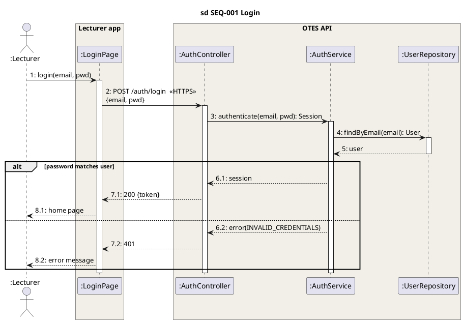
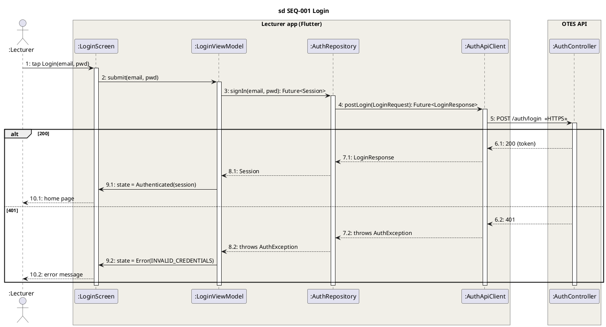

# Sequence diagram mẫu — SEQ-001 Login, theo kiến trúc khai báo

Mẫu để reviewer **so vào**, không phải để sinh viên chép. Hai phiên bản cùng một use case, hai kiến trúc — để thấy kiến trúc quyết định lifeline. Cả hai đều PlantUML (StarUML nhập được).

## Cú pháp UML 2.5 mà cả hai bản đều phải có (`uml25-diagram-policy.md` §11)

1. Khung `sd SEQ-NNN <tên>` — ID trace về FR.
2. Lifeline đặt tên `:Type`; `Type` phải là class/component có trong class diagram (chain 3) **và** đúng vai của kiến trúc (chain 7b).
3. Message sync = đường liền + đầu mũi tên **đặc**; nhãn = operation **có tham số và kiểu trả về**.
4. Reply = đường **đứt** + đầu mũi tên **hở**; nhãn = **giá trị trả về**, không phải tên hàm.
5. Execution specification (thanh dọc) khi đối tượng đang xử lý.
6. Combined fragment `alt` ≥ 2 operand, mỗi operand có guard `[…]`.
7. Đánh số liên tục `1, 2, 3…`; trong `alt`/`opt` nhánh *k* đánh `n.k` (`6.1, 7.1, 8.1` / `6.2, 7.2, 8.2`) — house style, xem `uml25-diagram-policy.md` §11. Không dấu X trên lifeline của service/repository (chúng không chết theo request).
7b. **Combined fragment theo house style FPT** (Q7): ô ngũ giác ghi **điều kiện** (`password matches user`), **không** chữ `alt`, không ngoặc vuông. Fragment hai nhánh: nhánh dưới **không nhãn** (suy ra là phủ định). Từ ba nhánh: mỗi nhánh ghi điều kiện riêng. `opt` và `loop` vẫn ghi chữ. Hình vẽ đúng spec (tab `alt` + `[guard]` trong operand) cũng được chấp nhận. *(PlantUML không render được đúng house style này — nó luôn in `alt`; sinh viên vẽ StarUML/draw.io thì sửa nhãn tab. Mã PlantUML dưới đây vì thế là bản spec, hình render tay mới là bản house style.)*
8. **Ranh giới container** vẽ tường minh (đường chấm dọc hoặc `box`), message qua ranh giới ghi **protocol** (chain 7d).

---

## Bản A — Layered REST API (client → HTTPS → Controller → Service → Repository)

Khai báo ở SDS §2.1: *"Layered REST API, ADR-0002"*. Lecturer app là một container, OTES API là container khác.

Check chain 7 cho bản này: 7a ✓ (style + ADR) · 7b 5/5 lifeline đúng vai (Page = boundary, Controller = boundary API, Service = control, Repository = adapter DB) · 7c 11/11 message đi xuống từng tầng, reply đi lên · 7d 1/1 ranh giới có `HTTPS POST /auth/login` · 7e đòi class diagram có package `controller`, `service`, `repository`, `domain` với `LoginRequest` (DTO) ≠ `User` (entity).

---

## Bản C — MVVM Flutter (View → ViewModel → Repository → ApiClient), dữ liệu một chiều

Khai báo ở SDS §2.1: *"MVVM theo Flutter app architecture guide, state bằng Riverpod, ADR-0003"*. Khác bản A ở chỗ: kết quả về View **qua state**, không qua reply; View không bao giờ gọi Repository.

Điểm khác biệt reviewer phải thấy: message **9** là message thường `state = …` từ ViewModel tới View (dữ liệu chảy một chiều qua state), **không** phải reply. Repository đổi `LoginResponse` (DTO của API) sang `Session` (model của app) — nếu thấy `LoginResponse` chạy thẳng lên ViewModel là amber (`architecture-patterns.md` §2C).

Check chain 7: 7b 5/5 · 7c 15/15 (View→VM→Repo→Api→API, không nhảy) · 7d 1/1 · 7e đòi package `ui/login/view`, `ui/login/view_model`, `data/repositories`, `data/services`, `domain/models`.

---

## Cùng một hình, sai kiến trúc — ba mẫu sai để nhận diện

| Mẫu sai | Vi phạm | Chain |
|---|---|---|
| `:LoginPage → :AuthService` trực tiếp, bỏ Controller, không ranh giới | Nhảy tầng; không nói kiến trúc nào; ranh giới HTTP không tồn tại | 7a 0, 7c fail, 7d n/a |
| `:LoginScreen → :AuthRepository` trực tiếp (Flutter) | View là boundary gọi thẳng data layer, bỏ ViewModel | 7c red — boundary→control bị bỏ |
| `:User → :LoginPage : showHome()` | Entity gọi boundary | 7c red — luật robustness |

Bản đầu tiên tôi vẽ cho Amy (2026-09-15) chính là mẫu sai thứ nhất — đúng UML, sai kiến trúc. Giữ lại ở đây làm ví dụ.

## Lịch sử năm bản SEQ-001 — để thấy mỗi vòng sửa gì

| Bản | Sửa gì | Ai bắt |
|---|---|---|
| 1 | 2 lifeline, không kiến trúc | Amy: "có theo architecture không?" |
| 2 | 5 lifeline theo Layered REST, ranh giới container, HTTPS | Amy: guard đặt cạnh tab, hai nhánh cùng số |
| 3 | Guard lên trên message đầu nhánh tại lifeline gửi (đúng spec); đánh số `6.1/6.2` | Amy: "điều kiện phải nằm trong ô ngũ giác" + ảnh mẫu FPT |
| 4 | Điều kiện vào ô ngũ giác, bỏ `alt`, giữ `else` — house style FPT, override spec có ký (Q7) | Amy: "sao còn else, bỏ đi" |
| 5 | Bỏ `else`; nhánh hai không nhãn. Luật bù chỉ còn cho ≥ 3 nhánh | — |

Năm bản, bốn lỗi khác loại: kiến trúc → vị trí → đánh số → quy ước hội đồng (bản 5 chỉ là bản 4 sau khi Amy bỏ `else`). Reviewer chấm sequence phải qua đủ bốn tầng đó, không chỉ tầng cú pháp.
